### [1. Dashlane](https://www.dashlane.com/)
A password manager is a must 🔐. It is multi-platform password manager (Mac, Windows, Linux, Android, iOS) and recommended by Apple, has all the latest Features and Integrations and Chrome Extension, plus your productivity can benefit from a place to store all your passwords and easily use them whenever necessary.

  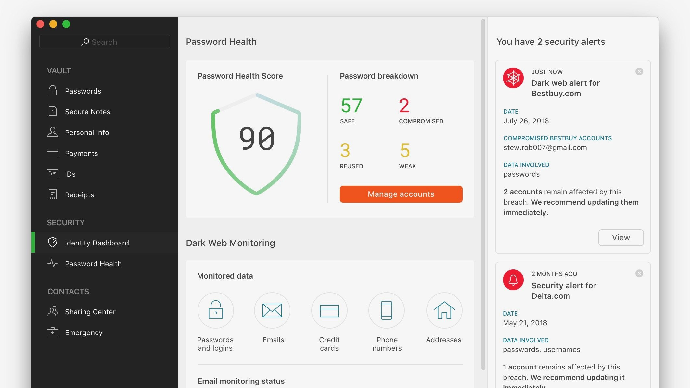
  <figcaption>Dashlane Interface</figcaption>

### [2. Zenhub](https://www.zenhub.com/)
IMO is the only project management tool that integrates natively within GitHub’s user interface. You don’t get any configuration headaches, no separate logins. Developers stay in an environment they love, and Project Managers get total visibility into the development process.

  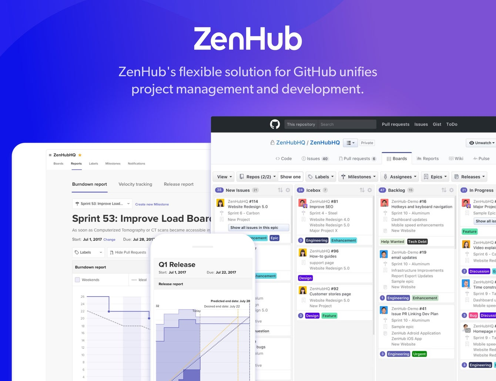
  <figcaption>Zenhub Extension</figcaption>

### [3. Raindrop](https://raindrop.io/)
a Smart all-in-one multi-platform bookmark manager (Mac, Windows, Linux, Android, iOS) for your inspiration, read later, media and stuff. It integrates auto-tagging, fast search, preview capture, drag and drop features, plus it has browser extension in *[Chrome](https://chrome.google.com/webstore/detail/raindropio/ldgfbffkinooeloadekpmfoklnobpien)*, *[Firefox](https://addons.mozilla.org/en-GB/firefox/addon/raindropio/)*, Safari and Opera.

  
  <figcaption>Raindrop Extension</figcaption>

### [4. Muzli](https://muz.li/)
a must chrome extension that curates and aggregates the most inspirational design Websites, blogs, resources and links on a daily basis.

  
  <figcaption>Chrome new empty tab look with Muzli</figcaption>

### [5. React Devtools](https://chrome.google.com/webstore/detail/react-developer-tools/fmkadmapgofadopljbjfkapdkoienihi?hl=en)
If you are React Developer then you need this ;). It provides an extra set of React-specific inspection widgets to assist you with development that allows you easily inspect/debug your component hierarchies and the current state and props of each component you select in the Chrome Developer Tools.

  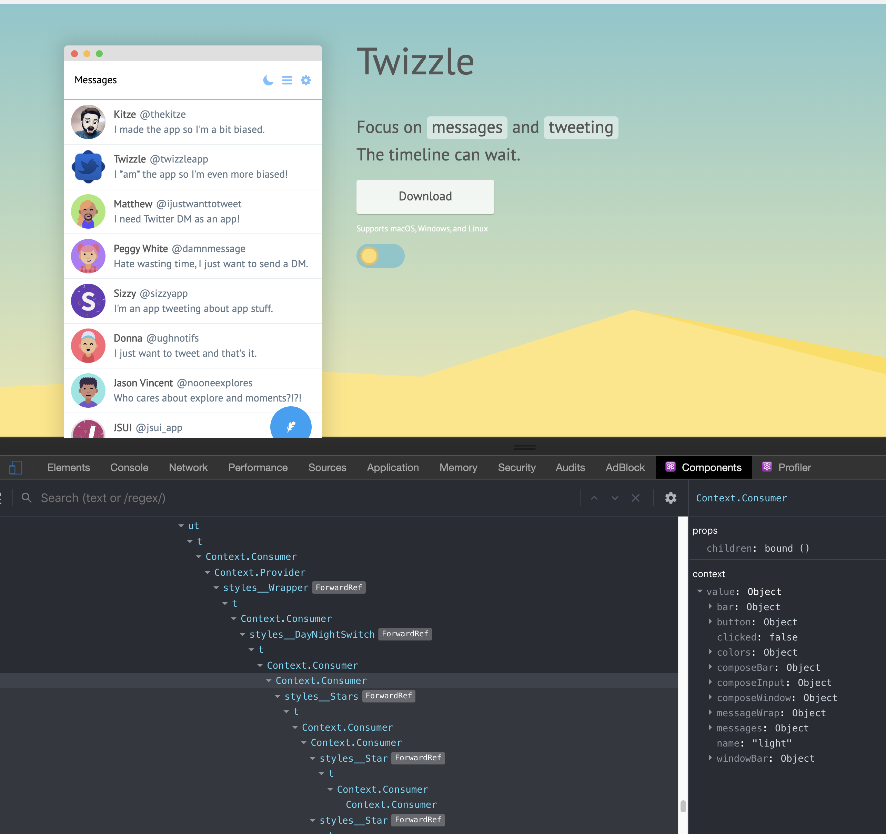
  <figcaption>React DevTools</figcaption>

### [6. Redux DevTools](https://chrome.google.com/webstore/detail/redux-devtools/lmhkpmbekcpmknklioeibfkpmmfibljd?hl=en)
If you are using Redux in your React Applications then you must have this one. It improves your development workflow that help you in visualising all the complex events that are happening in a redux application under the hood.

  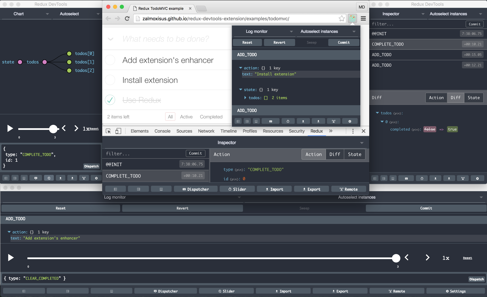
  <figcaption>Redux DevTools</figcaption>

### [7. Gif Scrubber](https://chrome.google.com/webstore/detail/gif-scrubber/gbdacbnhlfdlllckelpdkgeklfjfgcmp?hl=en)
It's like a movie player but for animated GIFs. It allow you to Control Animated GIFs in Chrome playing GIF animations with various speeds, and automatically scrub GIFs when they are opened.

  
  <figcaption>Interactive Gif Scrubber</figcaption>

### [8. CSS Peeper](https://csspeeper.com/)
a beautiful Smart CSS viewer tailored for Designers that allows you to inspect page elements in a stunningly beautiful way . You can check what fonts, sizes, colors do they use, and most importantly includes a tab for page assets, making it easy to extract images, either one by one or all together packed as a .zip file.

  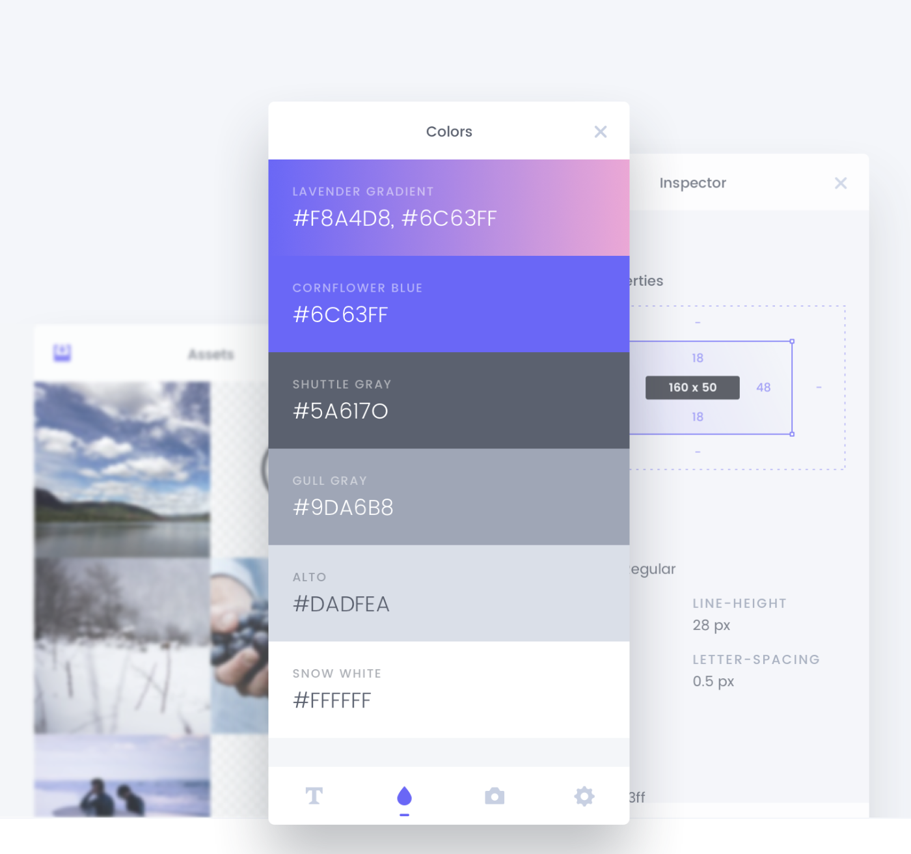
  <figcaption>CSS Peeper Tabs</figcaption>

### [9. Palettab](https://palettab.com/)
a browser extension which uses Google fonts and amazing ColourLovers palettes to inspire you with fresh and clean inspiration every time you hit that new tab button!

  
  <figcaption>Palettab Minimal UI</figcaption>

### [10. Finch Developer Tools](https://chrome.google.com/webstore/detail/finch-developer-tools/phgdjnidddpccdkbedmfifceiljljgdo?hl=en)
It allows you to save, sync and share style changes from within Chrome DevTools inspector

  
  <figcaption>Change UI style direct inside inspector</figcaption>

  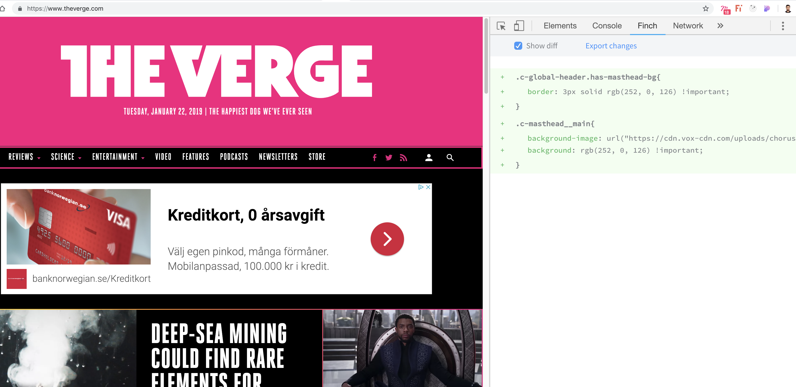
  <figcaption>Export your changes as CSS file</figcaption>

### [11. The Great Suspender](https://chrome.google.com/webstore/detail/the-great-suspender/klbibkeccnjlkjkiokjodocebajanakg?hl=en)
is a lightweight chrome extensio that can bring back your computer’s valuable resources that were being consumed by opened tabs. It can automatically suspend some tabs that have not been used for a given amount of time. Suspended tabs are not closed completely but are in a state where they consume minimum resources.

  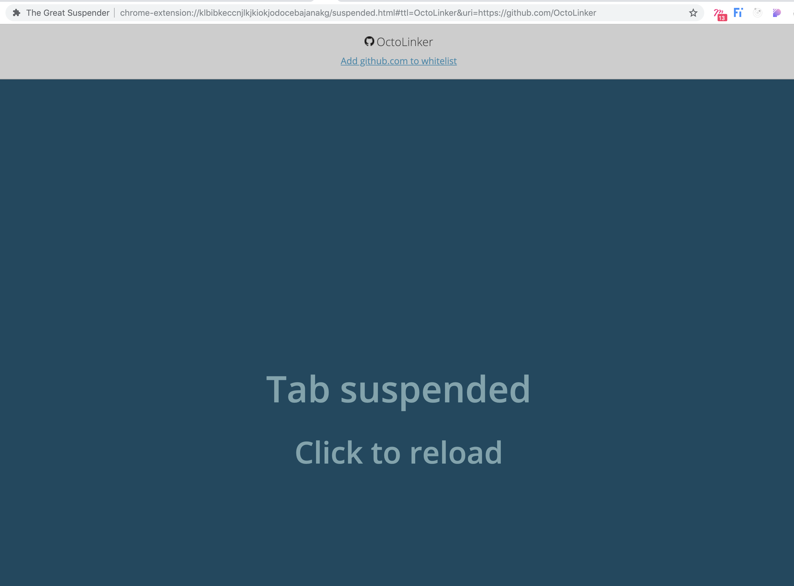
  <figcaption>Suspended page</figcaption>

### [12. Browserstack](https://www.browserstack.com/)
is a way to get access to many different browsers for testing using a browser. It allows you to test websites in real mobile and desktop browsers and operating systems with a click from your Chrome browser.

  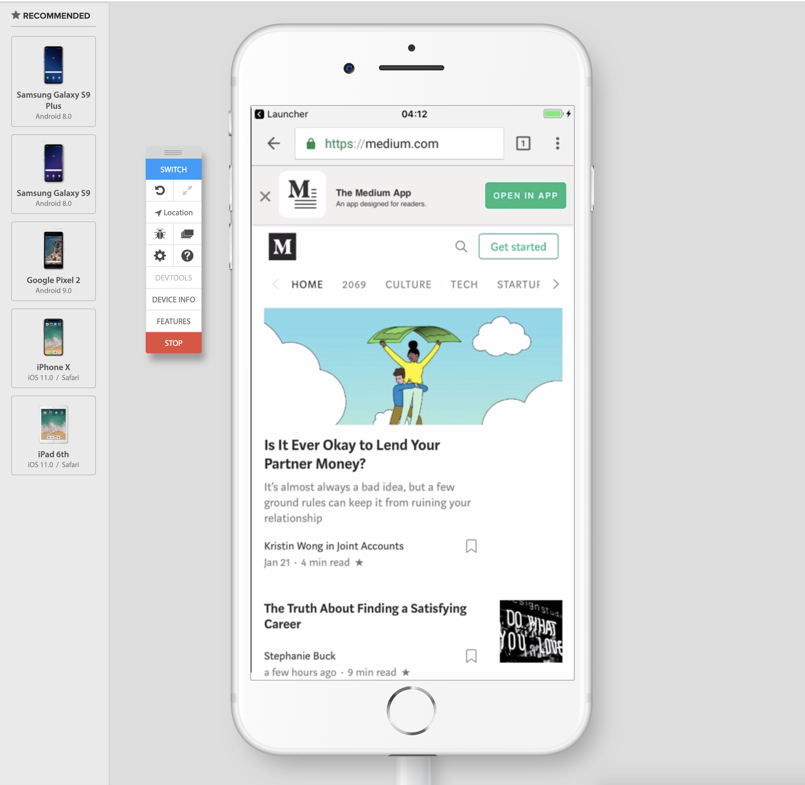
  <figcaption>Browserstack iPhone 8 Plus Simulator</figcaption>

### [13. OctoTree](https://chrome.google.com/webstore/detail/octotree/bkhaagjahfmjljalopjnoealnfndnagc)
For those who hates browsing source codes on Github, Octotree is a huge time saver. It lets you traverse through Git repo with a side navigation 🔥

  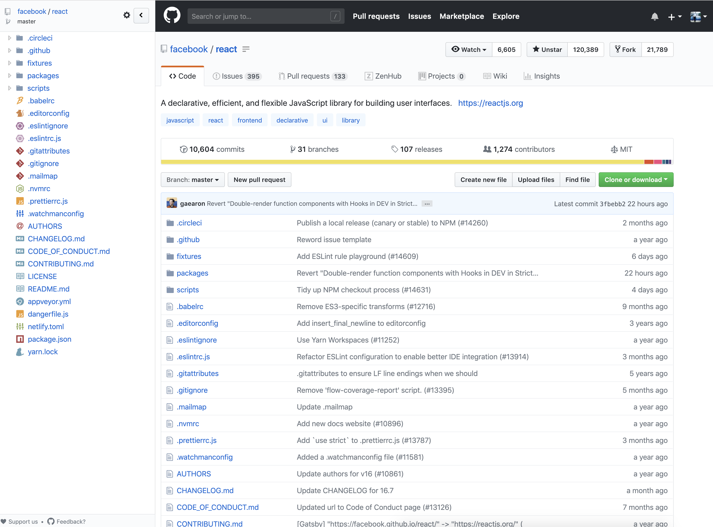
  <figcaption>Octotree File Explorer</figcaption>

### [14. OctoLinker](https://chrome.google.com/webstore/detail/octolinker/jlmafbaeoofdegohdhinkhilhclaklkp)
is a handy utility I never want to miss that turns language-specific module-loading statements like include, require or import into links allowing you to navigate through code on GitHub.

  
  <figcaption>Navigate through Imported Modules as links</figcaption>

### [15. Ekill](https://chrome.google.com/webstore/detail/ekill/lcgdpfaiipaelnpepigdafiogebaeedg?hl=en)
is like xkill, but for annoying web pages instead, that allows you quickly getting rid of any elements on a web page.

  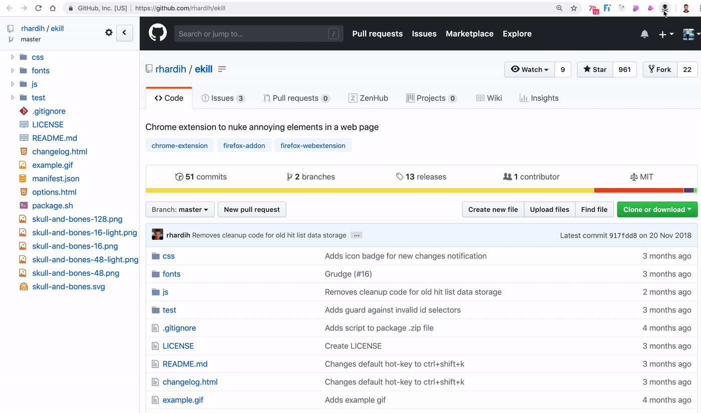
  <figcaption>Ekill in action</figcaption>

### [16. JSON Lite](https://chrome.google.com/webstore/detail/json-lite/acacmjcicejlmjcheoklfdchempahoag)
is a fast non-blocking JSON viewer. It formats JSON and JSONP responses with proper syntax highlighting and a node collapsing feature that is handy when inspecting huge JSON data. Also, it has the capability to handle show large JSON files.

  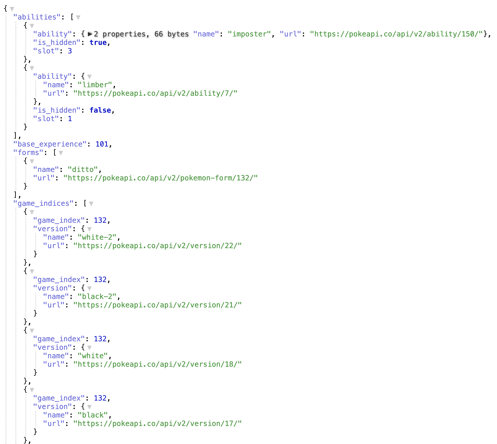
  <figcaption>JSON Lite</figcaption>

I hope this guide has been helpful for you. Liked this article? Then highlight any section in the article and smash that share button. It means a lot.🙌
Thanks for reading!
