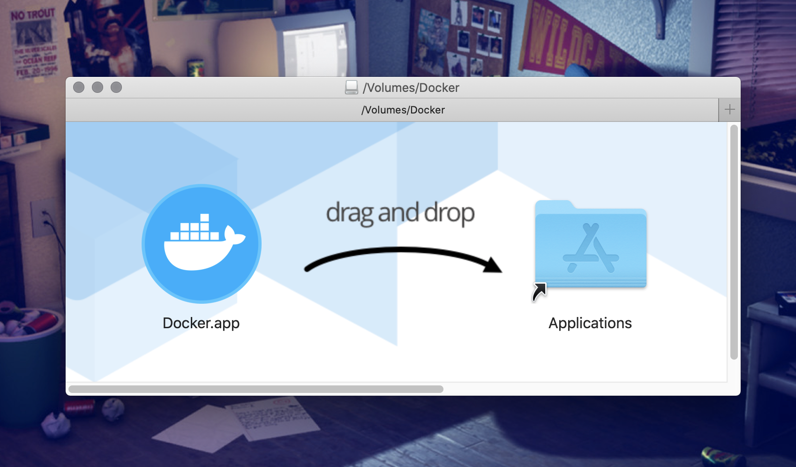
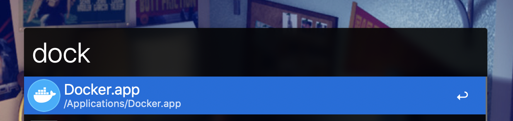
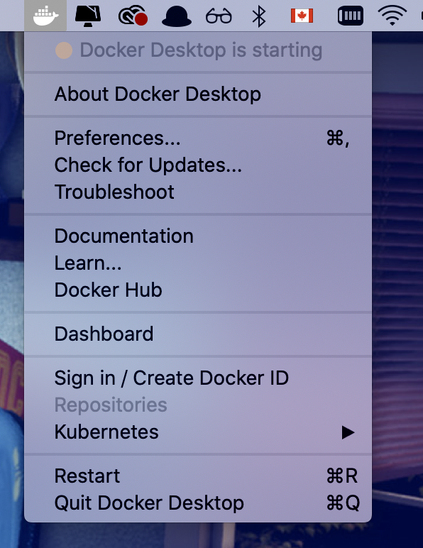

### What is Docker?
It is a tool that allows you to easily share, deploy, and run applications consistently in many environments through containers. It's available Mac, Linus, and Windows. Since, I am Mac user I am going to show you how to install it on **macOS**.
For other platforms see:
- [Linux](https://docs.docker.com/engine/install/)
- [Windows](https://docs.docker.com/docker-for-windows/install/)

### Installation
First, you need to download Docker Desktop Mac, you can download it from docker hub **[here](https://hub.docker.com/editions/community/docker-ce-desktop-mac/)**.

If you wonder that is Docker Hub, it's an online repository similar to **[GitHub](https://github.com/)** & **[NPM](https://www.npmjs.com/)**
but Docker images and the login that Docker Desktop will connect to.

Once download is completed, **double-click** the DMG file, and **drag-and-drop** Docker into macOS **Applications** folder:

<div class="Image__Small">
  
  <figcaption>Docker installation</figcaption>
</div>

This installs the following:

- Docker Engine
- Docker CLI Client
- Docker Compose
- Docker Machine

Double-click **Docker.app** which you can find inside **Applications** folder to start Docker.

<div class="Image__Small">
  
  <figcaption>Docker App</figcaption>
</div>

You can see the **whale** in your status bar which indicates Docker is running and accessible:

<div class="Image__Small">
  
  <figcaption>Status Bar</figcaption>
</div>

Once all this is completed, you can ensure **Docker CLI** is set up and working by checking the versions of **Docker Engine**, **Compose**, and **Machine**

```bash
$ docker --version
$ docker-compose --version
$ docker-machine --version
```

To make sure everything is working as expected, you can run a simple dockerized web server:

```bash
$ docker run -d -p 80:80 --name webserver nginx
```

That’s it!

You’ve got Docker running! Let’s talk about the concept of images and containers in the following [blog]((/writing/understand-the-concept-of-images-and-containers)).

If you have enjoyed this article? drop a coffee ☕️ tip [here](https://www.buymeacoffee.com/ahmedab) or [support](https://www.patreon.com/ahmedabdulrahman) me for less than the cost of a coffee.

Thanks for reading!
- - - -
