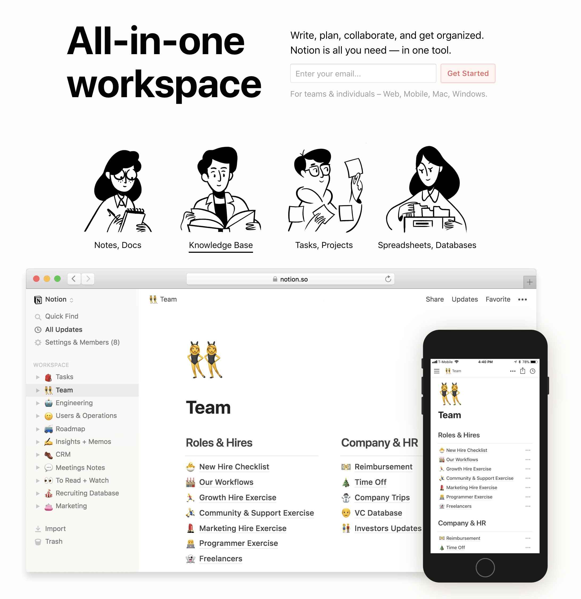
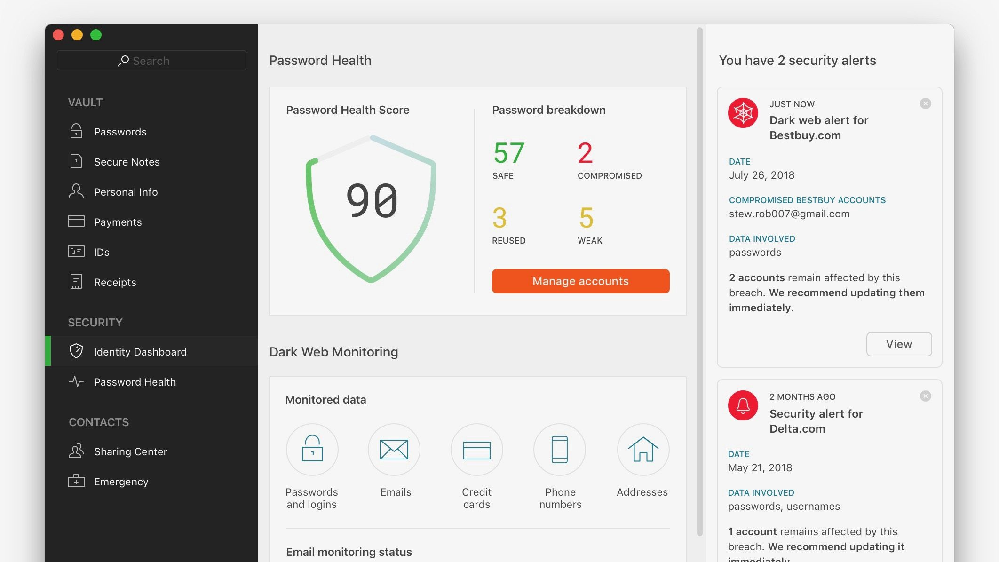
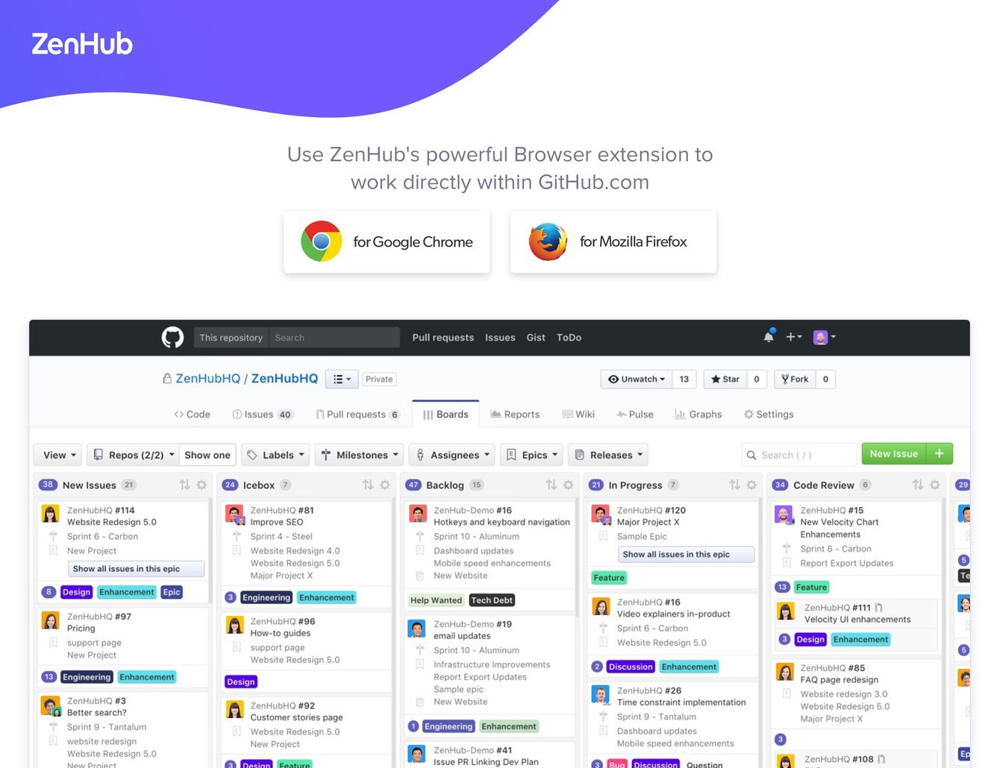
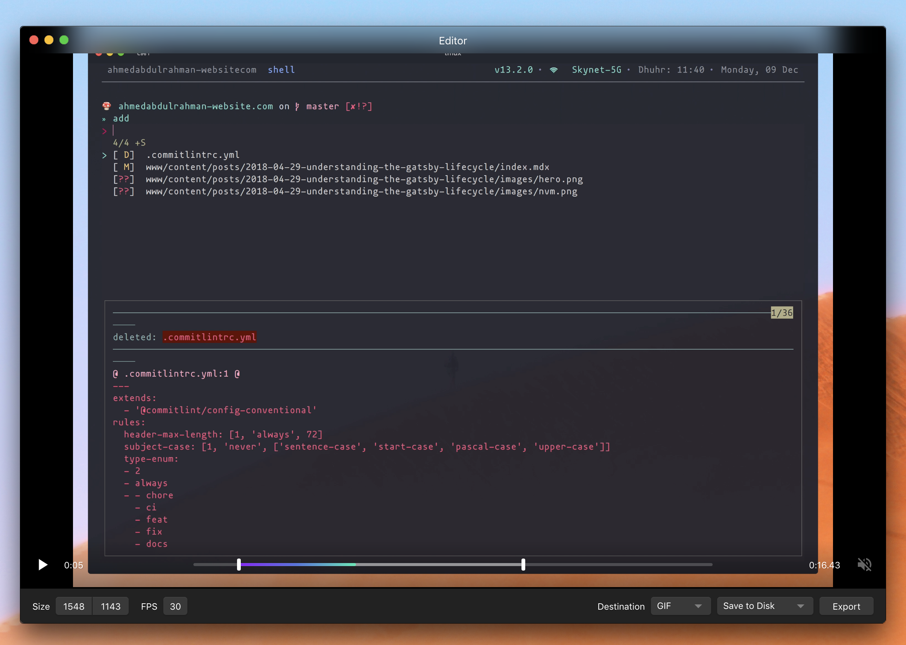

There are many tools that helps me work towards my goal of ultimate efficiency in my daily workflow. I took some time to write a list of all essential tools and apps and share it with you, which is mainly focused on development, design and management. So, let's talk tools:

### Dev tools 🛠
- **[iTerm2](https://www.iterm2.com/):** It’s the best lightweight replacement app for default macOS terminal. It has cool features such as Search, Autocomplete.. etc
- **[Visual Studio Code](https://code.visualstudio.com/):** is my second text editor of choice after VIM
- **[Docker](https://www.docker.com/)🐬:** Its my way out of Node & Python environment-hell on macOS when building microservices and also for environments to run CI/CD pipelines in. Docker make it easy to quickly testing something locally on your machine without needing to install it, such as Elasticsearch, Postgress, Redis and more…
- **[Vagrant](https://www.vagrantup.com/):** is an open-source program for developers. It’s designed to create and maintain portable, virtual, software-development environments. Mostly using it for Wordpress Development (get my repo here)
- **[Cyberduck](https://cyberduck.io/) 🐣:** is a free remote FTP management client alternative to [Transmit](https://panic.com/transmit/). It's available for both MacOS and Windows.
- **[SequelPro](http://www.sequelpro.com/):** is an easy SQL management tool that allow you to visually manage your databases using favorites, colors and emojis ⛑
- **[Rager](https://ranger.github.io/):** is a dynamic command line User Interface for complete system file management needs. It supports VI binds for easier access across the whole of your system
- **[Homebrew](https://brew.sh/):** as the creators of this app says it’s missing package manager for macOS, allows you to install and update pretty much everything on your mac including command line tools.
- **[Cakebrew](https://www.cakebrew.com/)🎂:** allows you to manager all your Homebrew formulas using GUI interface.
- **[FZF](https://github.com/junegunn/fzf)** 🔥: is a fuzzy finder command line application for your terminal that filters each line from given input with a query that the user types. When the query changes, the results update in realtime. You can plug it even with VIM and Git as well.
- **[Taskwarrior](https://taskwarrior.org/)** and **[Timewarrior](https://timewarrior.net/)** 🕰 : are an independent but related pair of productivity command line tools, that allow you to track tasks (what is to be done?) and time (on what have I spent my time?), hence their name.
- **[HTTPie](https://httpie.org/)** : is a command line HTTP client, like Internet Explorer; only it doesn’t have a UI 😶. It has JSON support, syntax highlighting, wget-like downloads, extensions, etc.
- **[tldr](https://tldr.sh/)**: is a simplified and community-driven man pages. It gives you a succinct examples on how you actually use commands.
- **[jq](https://stedolan.github.io/jq/)**: is a lightweight and flexible command-line JSON processor
- **[pgcli](https://github.com/dbcli/pgcli)**: is a terminal client for Postgress with autocomplete and Syntax Highlighting.
- **[mycli](https://github.com/dbcli/mycli)**: same as pgcli but for mysql
- **[youtube-dl](https://ytdl-org.github.io/youtube-dl/index.html)**: It is a convenient piece of software if you ever stumble across an important, or relevant, talk that you like, letting you download it instantly to your computer and save for future use. Its a Python-built program that allows you to download videos from YouTube without having to leave your terminal 🔥. Guess what 🙃 you can download full youtube playlists at once and more …
- **[hostes](https://github.com/cbednarski/hostess)**: is a command-line utility for managing your **`/etc/hosts`** file.

### Productivity Tools
- **[Notion](https://www.notion.so/):** when it comes to been a productive, should never miss Notion s an all-in-one workspace where you can write, plan, collaborate and get organized. its one of the powerful modular productivity tools I’ve ever used.
  

    
    <figcaption>Notion is a note-taking and collaboration application</figcaption>
  

- **[Mind Node](https://mindnode.com/)**: enables you to brainstorm and create a visual representation of views for deeper understanding into connected chunks (or nodes) that can then be further abstracted away (with subnodes). In the end you get a tree, with children as nodes, all the way down to its leaves
- **[Alfred](https://www.alfredapp.com/):** is a turbocharged version of OSX’s Spotlight. Alfred serves as a command line for your entire computer, helping you launch apps, perform omni-search from anywhere, multiple clipboard, automation and integrations, with a universal hotkey.
- **[Karabiner](https://pqrs.org/osx/karabiner/):** It allows you to remap any key on your keyboard to do anything you want (macOS only)
- **[Dashlane](https://www.dashlane.com/):** a password manager is a must 🔐. It is multi-platform password manager (Mac, Windows, Linux, Android, iOS) and recommended by Apple, has all the latest Features and Integrations and *[Chrome Extension](https://chrome.google.com/webstore/detail/dashlane-password-manager/fdjamakpfbbddfjaooikfcpapjohcfmg?hl=en)*, plus your productivity can benefit from a place to store all your passwords and easily use them whenever necessary.
  

    
    <figcaption>Dashlane is a multi-platform password manager</figcaption>
  

- **[Spectacle](https://www.spectacleapp.com/):** allows you to move and resize your windows with with hotkeys!
- **[Hammerspoon](https://www.hammerspoon.org/):** an open-source project, which aims to bring staggeringly powerful macOS desktop automation into the Lua scripting language.
- **[Zenhub](https://www.zenhub.com/):** IMO it is the best project management tool that integrates natively within GitHub’s user interface. You don’t get any configuration headaches, no separate logins. Developers stay in an environment they love, and Project Managers get total visibility into the development process.
  

    
    <figcaption>Zenhub Project Management</figcaption>
  

- **[Aware](https://awaremac.com/)**: A simple menubar app for OSX and macOS that tracks how long you’ve been actively using your computer.
- **[Kap](https://getkap.co/):** is an open source screen recording app for macOS that is built using web technologies. It sits in your menubar and offers a number of different presets to quickly start a recording with a few simple clicks.
  

    
    <figcaption>Kap an open-source screen recorder built with web technology.</figcaption>
  

### Design Tools
- **[Figma](https://www.figma.com/):** is the design tool with real-time collaboration. it keeps everyone on the same page. Focus on the work instead of fighting your tools. I call it the big boy gives you the power, flexibility and speed. It works in web browsers, and there are also native apps that let you work offline.
- **[Photoshop](https://www.adobe.com/products/photoshop.html):** I use it only for retouching, an incredible tool for screen designs
- **[Zeplin](https://zeplin.io/):** is a handy dandy tool for better communication between designers and developers, converting designs made in Sketch or Figma to a code-friendly format. Zeplin 2.0 introduces Components, renaming assets, full size thumbnails in Dashboard, revamped interface for layer properties, Styleguide and Dashboard 🔥
- **[SVGO](https://github.com/svg/svgo)** and **[SVGOMG](https://jakearchibald.github.io/svgomg/):** both are SVG optimizers, one for Node.js environment, and other web based.
- **[SVGR](https://github.com/smooth-code/svgr):** is a web based online tool that transform your SVGs into React components 🦁
- **[ImageOptim](https://imageoptim.com/mac):** allows you to optimize huge retina images makes them load faster

### Communication Apps
- **[Discord](https://discordapp.com/):** is a communication app, much like Telegram, Slack or WhatsApp but for gamers + deve
- **[Slack](https://slack.com/intl/en-se/):** use it quite a bit to connect with our clients and new development team at the company!
- **[Spark](https://sparkmailapp.com/):** is an email app for macOS. It aims to keep you productive with smart twists on ordinary emails, such as an intelligent inbox, a snooze function, and effective signature management.
- **[Caprine](https://github.com/sindresorhus/caprine):** is an unofficial and privacy-focused Facebook Messenger app with many useful features.

Liked this article? Then highlight any section in the article and smash that share button. It means a lot.🙌
Thanks for reading!
